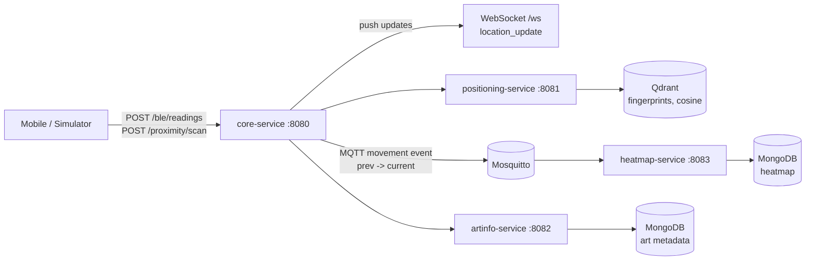
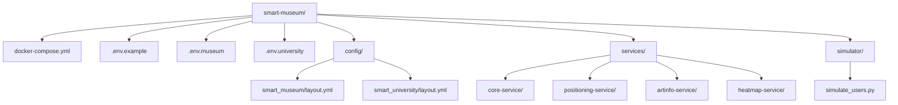

# Smart Museum

Smart Museum is a microservice-based indoor positioning platform that maps BLE and proximity signals into real-time floor/grid locations and exhibit context.

- BLE fingerprinting + vector search for robust indoor positioning.
- No training required: deterministic radio model and precomputed fingerprints.
- Deployment-agnostic: switch to a new environment by changing only config.

This system is deployment-agnostic: indoor positioning can be enabled in any new environment by updating only configuration files.

## Key Features

1. Real-time location updates via WebSocket.
2. BLE and QR/NFC ingestion through a single core API.
3. Qdrant cosine search for nearest fingerprint per floor.
4. MQTT-based occupancy transitions and heatmap persistence.
5. Service registry with ACTIVE/OFFLINE/DISABLED/REMOVED lifecycle.

## Key Idea

1. BLE readings are converted into a fixed-order numeric vector.
2. Fingerprint vectors are precomputed per grid cell and floor.
3. Cosine similarity search finds the nearest grid fingerprint at runtime.

## Architecture Overview



## Quick Start

### Prerequisites

1. Docker Desktop with Compose.
2. Java 21 and Maven 3.9+ (optional for local build).
3. Python 3.10+ (only for simulator).

### Run with museum profile

```powershell
docker compose --env-file .env.museum up -d --build
```

### Run with university profile

```powershell
docker compose --env-file .env.university up -d --build
```

### Stop

```powershell
docker compose down
```

### Optional local package build

```powershell
mvn -q -DskipTests package
```

## Deployment Model (Environment Switching)

1. `.env.<site>` defines deployment namespace and runtime endpoints.
2. `layout.yml` defines geometry, floors, beacon positions, and radio model.
3. Environment switch is command-based, not code-based:

```powershell
docker compose --env-file .env.museum up -d --build
docker compose --env-file .env.university up -d --build
```

## Deployment-Agnostic Design

1. No code change required for new site deployment.
2. No retraining required for switching layout/environment.
3. Configuration-only onboarding (`.env` + `layout.yml`).

## Positioning Logic

### Pipeline summary

1. Detect floor from floor-anchor beacon with highest RSSI.
2. Build runtime BLE vector with fixed beacon order.
3. Normalize RSSI values into [0,1].
4. Query Qdrant with floor filter and cosine distance.
5. Return top-1 grid as predicted position with score.

### Core normalization formula

$$
v = \frac{\text{clamp}(rssi, -100, 0) - (-100)}{100}
$$

### Seed fingerprint model (precompute)

$$
rssi = txPowerDb - 10 \cdot n \cdot \log_{10}(d / d_0)
$$

Distance uses 3D cell geometry (row/col/floor height). Values beyond max range or below cutoff RSSI are suppressed to minimum RSSI before normalization.

## Why This Approach

1. Why not pure triangulation:
RSSI in indoor spaces is noisy due to multipath and obstacles; strict geometric triangulation is unstable.
2. Why vector search:
Fingerprint matching is robust to local signal variation and works well with sparse/missing beacon reads.
3. Why no ML training:
Precomputed fingerprints with a configurable radio model reduce operational complexity and avoid retraining per deployment.

## Services

1. `core-service` (`http://localhost:8080`)
   - Entry API for BLE and proximity.
   - Orchestration, WebSocket push, MQTT movement publish.

2. `positioning-service` (`http://localhost:8081`)
   - Floor detection + vector build + Qdrant nearest search.

3. `artinfo-service` (`http://localhost:8082`)
   - Nearest artwork lookup (BLE flow).
   - Exact artwork lookup by `artId` (QR/NFC flow).

4. `heatmap-service` (`http://localhost:8083`)
   - Transition-based occupancy updates and periodic persistence.

5. Infrastructure
   - `qdrant` (`http://localhost:6333`)
   - `mongodb` (`mongodb://localhost:27017`)
   - `mosquitto` (`tcp://localhost:1883`)

## Config (Minimal YAML Example)

```yaml
museum:
  beacons:
    model:
      tx-power-db: -59
      path-loss-exponent: 2.2
      max-range-meters: 18
      cutoff-rssi: -85
    positions:
      - id: floor-beacon-f1
        floor: 1
        x: 0
        y: 0
        role: floor-anchor
      - id: beacon-3
        floor: 1
        x: 2
        y: 4
        tx-power-db: -57
```

## Limitations

1. RSSI is inherently noisy in real indoor environments.
2. Path-loss model is an approximation and may need calibration per building.
3. Beacon placement quality strongly affects positioning accuracy.
4. Extreme crowd/obstacle changes can reduce stability.

## Technology Stack

1. Java 21
2. Spring Boot 3.5.x
3. Maven multi-module
4. Qdrant 1.9
5. MongoDB 7
6. Eclipse Mosquitto
7. Docker + Docker Compose
8. Python simulator (`requests`, `websocket-client`, `pyyaml`)

## Repository Layout



## License

MIT